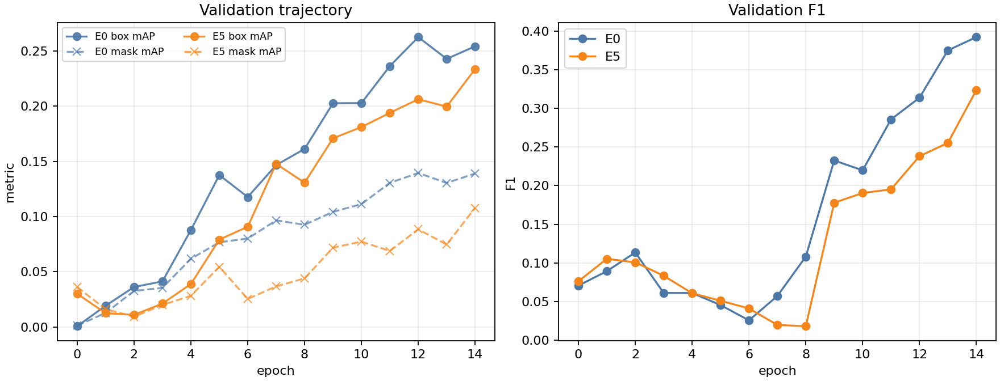
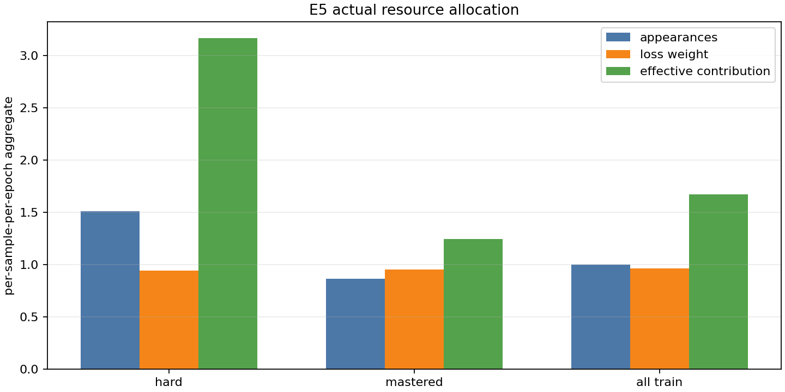

# RF-DETR Sample Dynamics — MVTec E5 Combined Validation

> Scope: **NON-BENCHMARK / MECHANISM VALIDATION**. This is one 15-epoch seed on the frozen MVTec Pilot v2 protocol; it is not a claim of general mAP improvement.

## Gate result

**E5 combined execution: PASS WITH CAVEATS.** The same-contract E0 baseline and E5 combined run completed 15 epochs, and the offline per-checkpoint evaluator produced 15 trajectory points for each run. The run is suitable for mechanism analysis and for deciding whether to schedule replicated ablations; it is not sufficient to freeze an algorithmic benefit claim.

The preceding RF4 longitudinal gate was `PASS_WITH_CAVEATS`. Its frozen `REFERENCE_HARD` set contains 33 samples and `REFERENCE_MASTERED` contains 43 samples. The five controlled-corruption samples remain a smoke subset only.

## Contract and artifacts

| Check | Result |
|---|---|
| Initial model hash, manifest, weights, seed equal | `True` |
| Locked resolution / batch / epochs / augmentation / EMA | `True` |
| E0/E5 epochs | 15 / 15 |
| Per-checkpoint trajectory points | 15 / 15 |
| E0 final checkpoint caveat | trajectory recovery comparison uses the last common real checkpoint (epoch 13); E0 metrics.csv still reports epoch 14 |
| StatePolicy tuning during this run | none; frozen policy retained |

## Overall validation metrics

| Run | Final mask mAP50:95 | Best mask mAP50:95 | Final box mAP50:95 | Final F1 | Elapsed / peak VRAM |
|---|---:|---:|---:|---:|---:|
| E0 baseline | 0.1390 | 0.1395 (epoch 12) | 0.2542 | 0.3922 | see run summary |
| E5 combined | 0.1079 | 0.1079 (epoch 14) | 0.2335 | 0.3235 | 519.0 s / 2.94 GiB |

The final mask-mAP difference `E5 - E0` is **-0.0311** on this single seed. Because CUDA training was not bitwise deterministic across retries and E0 epoch 14 uses a retained best-model fallback, this number is descriptive rather than causal evidence.

## Frozen hard-sample recovery

The hard subset is held fixed from the E2 reference trajectory; it was not redefined after looking at E5. The recovery table compares epoch 0 to the last common real checkpoint (epoch 13) because E0 epoch 14 was cleaned and its best_regular fallback records an earlier model state. A conservative descriptive recovery count is “per-image loss decreased”; the joint count additionally requires final mask IoU not to decrease. These are natural-recovery indicators, not proof that the sampler caused the recovery.

| Run | Hard samples | Loss decreased | Mask IoU increased | Loss decreased + mask IoU non-decreased |
|---|---:|---:|---:|---:|
| E0 | 33 | 33 (100.000%) | 16 (48.485%) | 32 (96.970%) |
| E5 | 33 | 33 (100.000%) | 22 (66.667%) | 33 (100.000%) |

Thus the current `HARD_LEARNABLE` label should still be read as a **high-loss candidate**. E5 does not yet establish learnability, and this run does not establish a statistically reliable E5 advantage over natural recovery under E0.

## Did E5 actually change training resources?

The resource ledger records the actual post-normalization loss weight, sampler exposure, capped effective contribution, and cap hits. Values below are averages over the 15 epochs per sample per epoch where appropriate.

| Frozen group | appearances / sample / epoch | exposure count / sample / epoch | policy weight | applied loss weight | effective contribution / sample / epoch | cap hits |
|---|---:|---:|---:|---:|---:|---:|
| REFERENCE_HARD | 1.5111 | 1.5111 | 1.1814 | 0.9427 | 3.1650 | 398 |
| REFERENCE_MASTERED | 0.8651 | 0.8651 | 0.9383 | 0.9519 | 1.2420 | 48 |
| ALL_TRAIN | 1.0000 | 1.0000 | 1.0291 | 0.9629 | 1.6736 | 524 |

The ledger confirms that E5 changed the resource path, but it also separates policy intent from realized optimization weight. The hard group's policy weight is higher on average, but global normalization plus cap constraints can make the realized applied loss weight lower or similar on individual appearances. Effective contribution is summed per appearance before the per-sample-per-epoch normalization, so replayed appearances are not undercounted. A cap hit is not automatically a benefit or a bug; it must be inspected as a side-effect guard in replicated runs.

## Probe and state side effects

E5 finished with state counts `{"HARD_LEARNABLE": 26, "LEARNING": 93, "MASTERED": 8, "SUSPECT": 1}` at policy version `15`. The final all-train `SUSPECT` count and the controlled-corruption TP/precision/recall are separated below; neither is promoted to an RF8 statistic.

### Controlled-corruption evidence

The table below is the **RF4 E2 reference trajectory**, not a new E5 corruption metric. It records the five frozen smoke samples' persistent conflict evidence before intervention. The E5 final-state table is shown separately and must not be interpreted as five corruption hits.

| Corruption | Sample | E2 final state | Max conflict streak | Final analysis conflict streak |
|---|---|---|---:|---:|
| mask_shift | `train:1023827126115464097:grid/test/thread/006.png` | HARD_LEARNABLE | 15 | 15 |
| drop_mask | `train:1718245752427016899:pill/test/faulty_imprint/014.png` | LEARNING | 0 | 0 |
| mask_shift | `train:4832004734997902173:capsule/test/crack/020.png` | HARD_LEARNABLE | 15 | 15 |
| drop_mask | `train:5899465832141176488:grid/test/broken/003.png` | LEARNING | 0 | 0 |
| drop_component | `train:6016708638749308861:grid/test/broken/010.png` | HARD_LEARNABLE | 12 | 0 |

| Controlled-corruption sample | E5 final state |
|---|---|
| `train:1023827126115464097:grid/test/thread/006.png` | HARD_LEARNABLE |
| `train:1718245752427016899:pill/test/faulty_imprint/014.png` | LEARNING |
| `train:4832004734997902173:capsule/test/crack/020.png` | HARD_LEARNABLE |
| `train:5899465832141176488:grid/test/broken/003.png` | LEARNING |
| `train:6016708638749308861:grid/test/broken/010.png` | HARD_LEARNABLE |

The E5 aggregate smoke summary is: all-train `SUSPECT` count=`1`, corruption TP=`0`, precision=`0.0`, recall=`0.0`. These remain smoke observations, not RF8 estimates.

The per-checkpoint evaluator also saved loss, mask IoU, FN, FP, and class-error for every train image. Its loss trajectory uses train mode with gradients disabled to preserve the RF-DETR training criterion's group-detr semantics; the probe uses eval mode and restores RNG. The CSV is the audit table for the frozen hard/mastered subset trajectories; the JSON contains the complete 128-image trajectories.

## Conclusions and next gate

1. The RF4 observation/state infrastructure now supplies a frozen, reusable hard subset and an auditable trajectory. That part is ready to support intervention comparisons.
2. E5 combined is technically executable and demonstrably changes exposure/loss resources, but this single seed does not prove an algorithmic gain over E0.
3. The correct next step is **replication under the same frozen contract**, preferably E0/E3/E4/E5 as a complete matrix. Do not tune StatePolicy or reinterpret the hard label from this run.
4. RF8 corruption precision/recall and migration-contract freeze remain pending.

### Generated evidence

- [Full E5 analysis JSON](mvtec_e5_combined_analysis.json)
- [E0/E5 result CSV](mvtec_e5_combined_results.csv)
- [Checkpoint trajectory JSON](mvtec_e0_e5_checkpoint_trajectories.json)
- [RF4 frozen subsets](mvtec_reference_subsets.json)
- [Overall metric figure](assets/e5_overall_metrics.svg)
- [Resource figure](assets/e5_hard_resource_recovery.svg)
