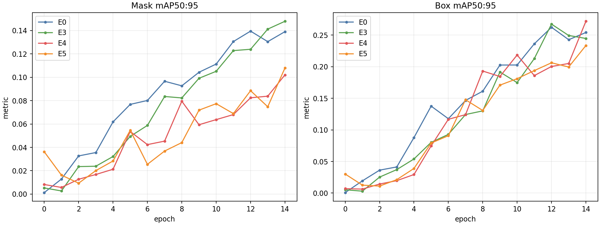
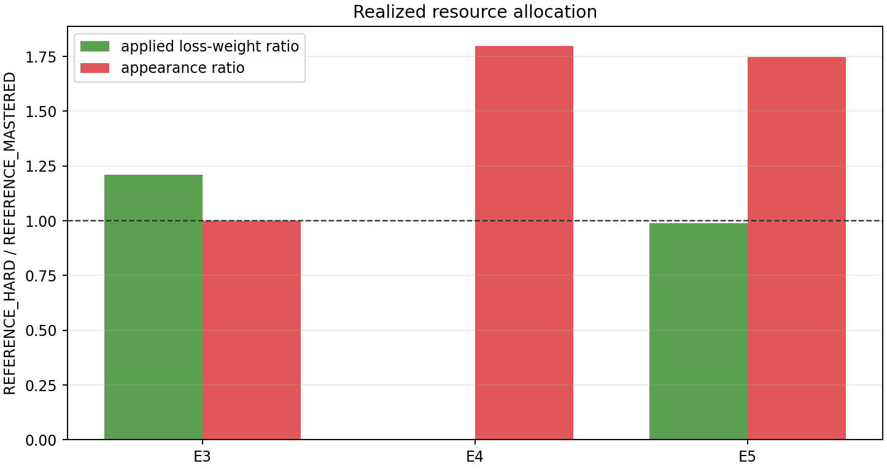

# RF-DETR Sample Dynamics — Seed1 完整消融验证

> 范围：**NON-BENCHMARK / SINGLE-SEED MECHANISM VALIDATION**。本报告用于验证机制是否真实生效，并观察单 seed 信号；不能据此宣称算法稳定提升。

## Gate 结论

**Seed1 里程碑：correctness `PASS`，resource mechanism `PASS`，algorithm signal `MIXED_SINGLE_SEED`。**

E0、E3、E4、E5 均在 Pilot v2、RF-DETR Seg Small、seed=20260810、15 epoch 的冻结契约下完成。初始模型、预训练权重、manifest、seed、完整 model config 及除干预开关/输出路径以外的完整 train config 全部一致。四条轨迹各有 15 个离线观察点；E0 epoch 14 是 `best_regular` fallback，其余为真实 epoch checkpoint，所以逐图恢复统一比较到共同真实 epoch 13。没有调整 StatePolicy。

## 两部分实验设计

1. **样本 Loss 分析与分类**：逐图记录 per-image normalized loss，通过长期状态将样本分为 `LEARNING / HARD_LEARNABLE / MASTERED / SUSPECT`；本轮所有比较使用 E2 预先冻结的 33 个 `REFERENCE_HARD` 与 43 个 `REFERENCE_MASTERED`，不根据 intervention 结果重新定义。
2. **下一轮资源调度**：E3 只改变 loss 权重，E4 只改变下一轮采样曝光，E5 同时改变二者；资源账本记录实际 batch 权重、实际出现次数和 capped effective contribution，而不是只读取配置开关。

## 最终验证指标

| Run | final mask mAP | Δmask vs E0 | final box mAP | Δbox vs E0 | final F1 | ΔF1 vs E0 | best mask mAP |
|---|---:|---:|---:|---:|---:|---:|---:|
| E0 | 0.1390 | 0.0000 | 0.2542 | 0.0000 | 0.3922 | 0.0000 | 0.1395 (e12) |
| E3 | 0.1479 | 0.0089 | 0.2448 | -0.0094 | 0.3667 | -0.0255 | 0.1479 (e14) |
| E4 | 0.1020 | -0.0370 | 0.2719 | 0.0177 | 0.3210 | -0.0712 | 0.1020 (e14) |
| E5 | 0.1079 | -0.0311 | 0.2335 | -0.0206 | 0.3235 | -0.0686 | 0.1079 (e14) |

单 seed 呈现明显的指标分化：E3 最终 mask mAP 比 E0 高，但 box mAP 与 F1 较低；E4 的 box mAP 较高，但 mask mAP 与 F1 较低；E5 在本 seed 的三个最终指标均未超过 E0。这里应报告为“混合信号”，不能选择性宣称 E3 已经有效。

## 调度资源是否真的改变

表中均为 `REFERENCE_HARD / REFERENCE_MASTERED` 的实际累计均值。

| Run | applied loss weight | appearances / sample / epoch | effective contribution / sample / epoch | mechanism gate |
|---|---:|---:|---:|---:|
| E3 | 1.1222 / 0.9276 | 1.0000 / 1.0000 | 1.1222 / 0.9276 | True |
| E4 | n/a / n/a | 1.4990 / 0.8341 | n/a / n/a | True |
| E5 | 0.9427 / 0.9519 | 1.5111 / 0.8651 | 3.1650 / 1.2420 | True |

- E3 同时要求困难组实际 loss weight 高于 mastered、hard/mastered 曝光比严格为 1、cap hit 为 0。
- E4 同时要求困难组实际 appearance 高于 mastered、applied loss weight 与 weighted effective contribution 均未记录。
- E5 同时要求 hard/mastered exposure 和 effective contribution 比率大于 1，并明确记录 cap 命中。

因此，“识别困难样本 → 下一轮增加优化资源”的工程闭环已经可观测且可审计。但资源变多不等于效果必然变好，本 seed 已直接说明二者必须分开验收。

## 冻结困难子集的后续改善

为避免 E0 已清理的 epoch 14 checkpoint fallback 造成模型状态错配，逐图恢复统一比较 checkpoint epoch 0→13。

| Run | loss 下降 | mask IoU 上升 | loss 下降且 mask IoU 不降 |
|---|---:|---:|---:|
| E0 | 33/33 (100.000%) | 16/33 (48.485%) | 32/33 (96.970%) |
| E3 | 33/33 (100.000%) | 20/33 (60.606%) | 33/33 (100.000%) |
| E4 | 33/33 (100.000%) | 26/33 (78.788%) | 33/33 (100.000%) |
| E5 | 33/33 (100.000%) | 22/33 (66.667%) | 33/33 (100.000%) |

这些是描述性“后续改善”指标，并不证明 `HARD_LEARNABLE` 中每个样本都可学，也不能把自然恢复归因给调度。该状态名称在现阶段仍应解释为 **high-loss candidate**。

## 阶段结论与下一 Gate

1. Loss observer、四态分类、E3 权重路径、E4 采样路径、E5 组合路径均通过同一冻结契约下的真实训练与资源证据检查。
2. 当前没有稳定算法收益结论：E3/E4/E5 对不同指标作用方向不一致，E5 单 seed 为负信号。
3. 下一里程碑应固定完整矩阵、再跑 seed=20260811 和 20260812，输出 mean ± std；禁止只复现当前最有利的 E3 mask 指标。
4. Controlled corruption 仍只有 5 个 smoke 样本，不能升级为 RF8 precision/recall 结论；RF9 migration contract 也暂不冻结。

## 可审计证据

- [完整分析 JSON](mvtec_seed1_ablation_analysis.json)
- [逐 epoch/逐子集结果 CSV](mvtec_seed1_ablation_results.csv)
- [E0/E5 checkpoint trajectories](mvtec_e0_e5_checkpoint_trajectories.json)
- [E3 checkpoint trajectories](mvtec_e3_checkpoint_trajectories.json)
- [E4 checkpoint trajectories](mvtec_e4_checkpoint_trajectories.json)
- [E2 冻结子集](mvtec_reference_subsets.json)
- [指标图 PNG](assets/seed1_ablation_metrics.png)
- [资源图 PNG](assets/seed1_ablation_resources.png)

分析 JSON 保存了仍保留 checkpoint 和全部源账本的 SHA-256。E3/E4 epoch 0–13 checkpoint 已在逐图 trajectory 提取并校验后清理，故这些中间权重不可本地重放；其逐图 loss/probe 结果保留在 trajectory JSON 中。E3/E4 epoch 14、best checkpoints 以及 E0/E5 保留的 checkpoint 均已哈希。
