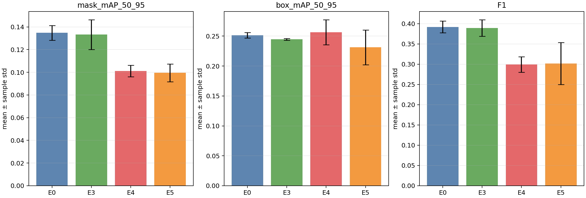

# RF-DETR Sample Dynamics — Three-Seed Ablation Validation

> Scope: **NON-BENCHMARK / THREE-SEED MECHANISM VALIDATION**. Seeds: 20260810, 20260811, 20260812. StatePolicy and E2-frozen subsets were unchanged.

## Gate

- Correctness: `PASS`
- Resource mechanisms: `PASS`
- Algorithm signal: `TARGETED_HARD_LOSS_RECOVERY_WITH_GLOBAL_REGRESSION_NO_DEPLOYMENT`
- Final metrics use epoch 14. Per-image hard recovery uses the common real checkpoint window epoch 0→13.
- Differences are paired within seed against that seed's E0; sample standard deviation uses `n-1`.

## Final validation metrics

| Run | mask mAP50:95 | box mAP50:95 | F1 | paired Δmask vs E0 |
|---|---:|---:|---:|---:|
| E0 | 0.1347 ± 0.0065 | 0.2515 ± 0.0045 | 0.3919 ± 0.0144 | baseline |
| E3 | 0.1333 ± 0.0131 | 0.2446 ± 0.0014 | 0.3893 ± 0.0205 | -0.0015 ± 0.0092 |
| E4 | 0.1012 ± 0.0050 | 0.2564 ± 0.0210 | 0.2993 ± 0.0190 | -0.0336 ± 0.0030 |
| E5 | 0.0995 ± 0.0078 | 0.2312 ± 0.0290 | 0.3016 ± 0.0519 | -0.0352 ± 0.0088 |

### Paired deltas against each seed's E0

| Run | Δmask mAP | Δbox mAP | ΔF1 | seeds with positive Δmask |
|---|---:|---:|---:|---:|
| E3 | -0.0015 ± 0.0092 | -0.0069 ± 0.0033 | -0.0027 ± 0.0286 | 1/3 |
| E4 | -0.0336 ± 0.0030 | +0.0049 ± 0.0166 | -0.0926 ± 0.0219 | 0/3 |
| E5 | -0.0352 ± 0.0088 | -0.0202 ± 0.0251 | -0.0903 ± 0.0655 | 0/3 |

## Realized resource ratios

Values are three-seed mean ± sample std of `REFERENCE_HARD / REFERENCE_MASTERED`; `n/a` means that resource was intentionally disabled.

| Run | applied weight ratio | appearance ratio | effective contribution ratio |
|---|---:|---:|---:|
| E3 | 1.2074 ± 0.0043 | 1.0000 ± 0.0000 | 1.2074 ± 0.0043 |
| E4 | n/a | 1.7385 ± 0.0605 | n/a |
| E5 | 1.0028 ± 0.0152 | 1.7080 ± 0.0424 | 2.4360 ± 0.1255 |

## Frozen hard-subset recovery

All deltas below are paired against the same seed's E0 over checkpoint epoch 0→13. Positive loss improvement means a larger loss decrease. The 33 IDs were frozen from E2 before intervention outcomes were observed.

| Run | Δ mean loss improvement | Δ mean mask-IoU improvement | Δ mask-IoU increase rate | seeds with positive Δloss improvement |
|---|---:|---:|---:|---:|
| E3 | +0.66 ± 11.90 | +0.0106 ± 0.0652 | -0.0000 ± 0.1093 | 2/3 |
| E4 | +20.31 ± 23.25 | +0.0635 ± 0.1587 | +0.0606 ± 0.2185 | 2/3 |
| E5 | +28.73 ± 11.31 | +0.0113 ± 0.1457 | -0.0101 ± 0.1972 | 3/3 |

## Decision

- **E3 Loss Weight:** overall performance is effectively neutral and directionally unstable. Mask delta is positive in only 1/3 seeds; box delta is negative in 3/3. The hard-subset loss and IoU deltas also change sign across seeds. This does not validate a benefit.
- **E4 Dynamic Sampler:** the intended exposure shift is strong and repeatable, but mask mAP and F1 are lower than E0 in 3/3 seeds. Hard-subset loss improvement is positive in 2/3 seeds and mask-IoU improvement is inconsistent. The current sampling quota is therefore not accepted as an algorithmic improvement.
- **E5 Combined:** the hard subset receives about 2.44× the effective contribution of mastered samples. Its mean loss improvement exceeds E0 in 3/3 seeds, but mask-IoU improvement is inconsistent and global mask mAP/F1 are lower in 3/3 seeds. This is evidence of targeted optimization, not successful overall scheduling.

The milestone result is therefore: **the observation→classification→next-epoch resource-allocation mechanism is correct and reproducible, while the frozen intervention policy over-focuses the selected hard subset and does not pass the algorithm-benefit gate. Do not deploy or freeze RF9 from these parameters.**

## Interpretation guardrails

1. This Pilot is a mechanism-validation dataset, not a benchmark claim.
2. Three seeds estimate variability but remain a small sample; paired consistency and metric trade-offs matter more than one favorable mean.
3. `HARD_LEARNABLE` remains a high-loss candidate label unless subsequent improvement is consistently greater than E0.
4. Controlled corruption remains a five-sample smoke subset and is not an RF8 precision/recall estimate.

## Evidence

- [Analysis JSON](mvtec_three_seed_ablation_analysis.json)
- [Result CSV](mvtec_three_seed_ablation_results.csv)
- [Metric plot](assets/multiseed_ablation_metrics.png)
