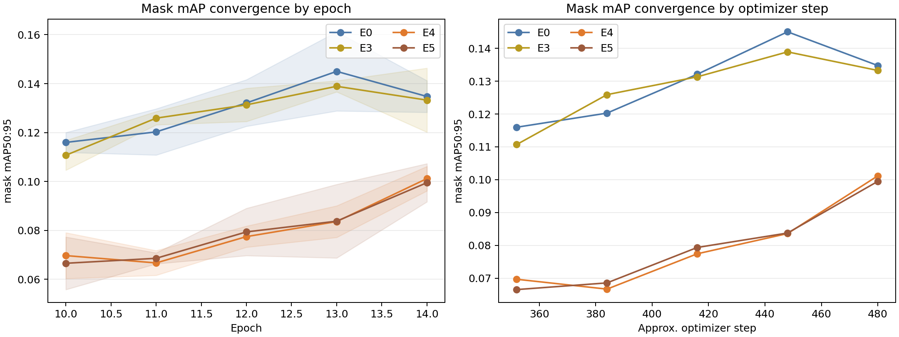

# Policy V2 Convergence Diagnosis

> Immutable V1 evidence baseline: `4cc9fc5e0392d3be31235d9ce93632a7f34a35ba`. This report is read-only over the 12 V1 runs.

## Result

**Decision: `USE_INDEPENDENT_30_EPOCH_CONTRACT`.** All 12 run-seeds have positive last-five-epoch mask-mAP slopes, and 10/12 reach their best mask mAP in epoch 13 or 14. The 15-epoch matrix therefore cannot exclude slower convergence as the main E4/E5 explanation.

## Last-five-epoch evidence

| Run | mask slope mean | box slope mean | F1 slope mean | positive mask slope seeds | late-best seeds |
|---|---:|---:|---:|---:|---:|
| E0 | 0.006230 | 0.012367 | 0.043792 | 3/3 | 2/3 |
| E3 | 0.005810 | 0.010098 | 0.044166 | 3/3 | 2/3 |
| E4 | 0.007987 | 0.014232 | 0.033728 | 3/3 | 3/3 |
| E5 | 0.008107 | 0.009646 | 0.027161 | 3/3 | 3/3 |

## Decision rule and limitation

The preregistered rule is: at least 75% of run-seeds have positive last-five mask-mAP slope AND at least 50% reach their best mask mAP in the final two epochs. This is descriptive convergence evidence, not proof that E4/E5 will catch E0. The next test must restart all compared runs from the same pretrained checkpoint under one 30-epoch contract; V1 checkpoints will not be resumed.
