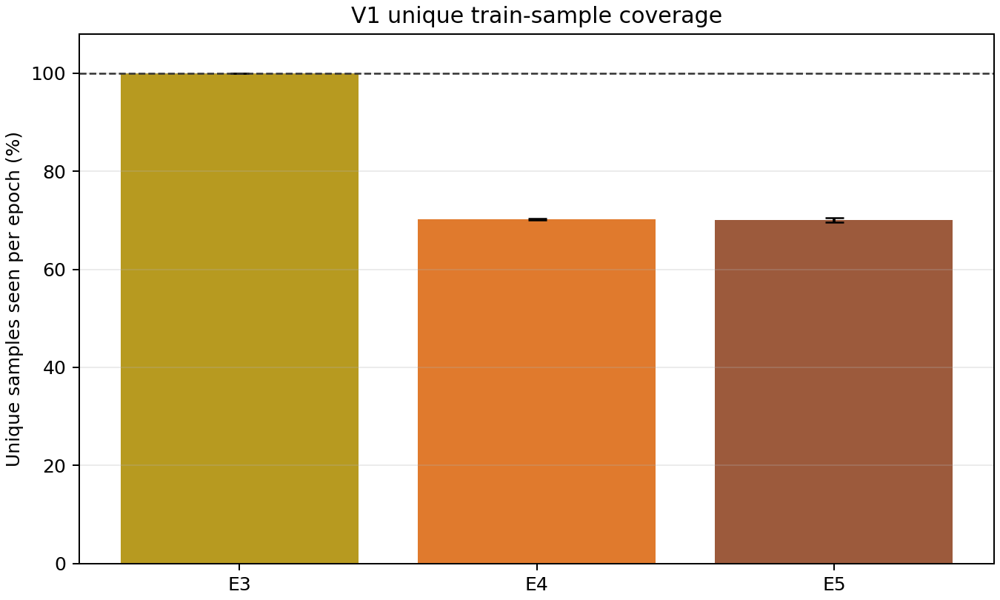

# Policy V2 V1 Coverage and Exposure Diagnosis

## Result

**The coverage-loss hypothesis is supported.** E3 preserves all 128 samples each epoch. E4/E5 keep the same 128 appearance budget but only expose about 70% unique samples, replacing roughly 38 ordinary-sample slots with duplicates every epoch.

| Run | Mean unique coverage | Mean omitted samples / epoch | Mean duplicate slots / epoch |
|---|---:|---:|---:|
| E3 | 100.00% | 0.00 | 0.00 |
| E4 | 70.19% | 38.16 | 38.16 |
| E5 | 70.07% | 38.31 | 38.31 |

This diagnosis establishes a mechanism-compatible explanation for V1 global regression, not causality. Policy V2 D1/D2 therefore retain 100% no-replacement base coverage and add a separately accounted hard bonus.
