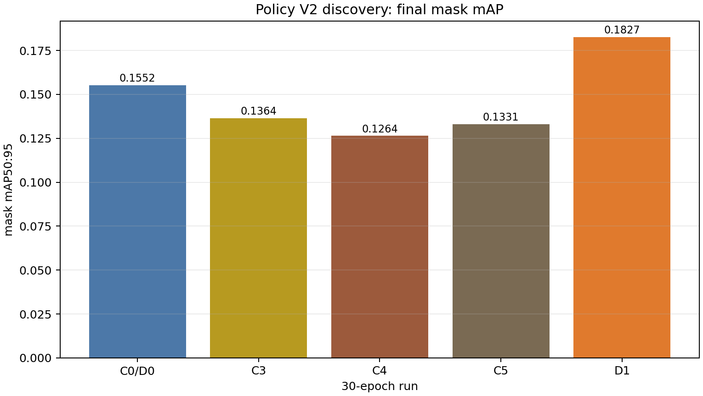

# Policy V2 30-Epoch Discovery Milestone

> Scope: one preregistered discovery seed (`20260813`), not confirmatory evidence.

## Technical summary

The 30-epoch control confirms that 15 epochs were not a settled convergence horizon, but extending training does not rescue V1 sampling: C4 and C5 remain below C0 at final epoch. D1 preserves full base coverage and adds only aligned post-warmup replay; its final mask delta versus C0 is `+0.0275`. This is a discovery signal only and cannot pass `ALGORITHM_BENEFIT` without new confirmatory seeds.

## Final and best validation evidence

| Run | Final mask | Δmask vs C0 | Final F1 | Best mask (epoch) | Steps | Wall-clock ratio |
|---|---:|---:|---:|---:|---:|---:|
| C0/D0 | 0.1552 | +0.0000 | 0.4211 | 0.1758 (e28) | 959 | 1.000× |
| C3 | 0.1364 | -0.0188 | 0.4000 | 0.1618 (e15) | 959 | 1.128× |
| C4 | 0.1264 | -0.0288 | 0.4211 | 0.1345 (e27) | 959 | 1.127× |
| C5 | 0.1331 | -0.0221 | 0.4074 | 0.1490 (e27) | 959 | 1.124× |
| D1 | 0.1827 | +0.0275 | 0.4667 | 0.1827 (e29) | 1009 | 1.069× |

## Resource and coverage evidence

| Run | Mean unique coverage | Total appearances | Replay appearances | Zero-exposure sample-epochs |
|---|---:|---:|---:|---:|
| C3 | 100.00% | 3840 | 0 | 0 |
| C4 | 69.40% | 3840 | 1175 | 1175 |
| C5 | 69.69% | 3840 | 1164 | 1164 |
| D1 | 100.00% | 4040 | 200 | 0 |

D1 uses 128 no-replacement base appearances in every epoch. From epoch 5 onward, the nominal 5% bonus is batch-aligned to 8 appearances (6.25% realized). Extra compute is therefore reported explicitly; D1 cannot claim an epoch-only advantage over C0.

## Frozen reference-subset recovery

The paired checkpoint trajectory uses the frozen V1 subsets and the same epoch 0→29 window. On `REFERENCE_HARD` (33 samples), D1 exceeds C0 by `+17.64` weighted per-image loss improvement, `+0.0985` matched-mask-IoU improvement, and `+0.1212` FN reduction per sample. On `REFERENCE_MASTERED` (43 samples), matched-mask-IoU and FN deltas are both `0`; the loss delta is `-0.011`, which is negligible at this scale. These are one-seed discovery measurements, not estimates of generalization.

## Gate

- Convergence diagnosis: `PASS` — 15 epochs was not a stable horizon.
- Coverage-preserving mechanism: `PASS` — 100% unique coverage, exactly 200 preregistered bonus appearances, and zero omitted sample-epochs.
- Discovery candidate gate: `PASS` — overall mask/F1 and Hard mask-IoU/FN all show a positive one-seed signal.
- Algorithm benefit: `NOT YET PASS`; no confirmatory claim is allowed from seed 20260813.
- Next gate: freeze D1 unchanged and run paired E0/D1 on untouched confirmatory seeds `20260814–20260816`.
