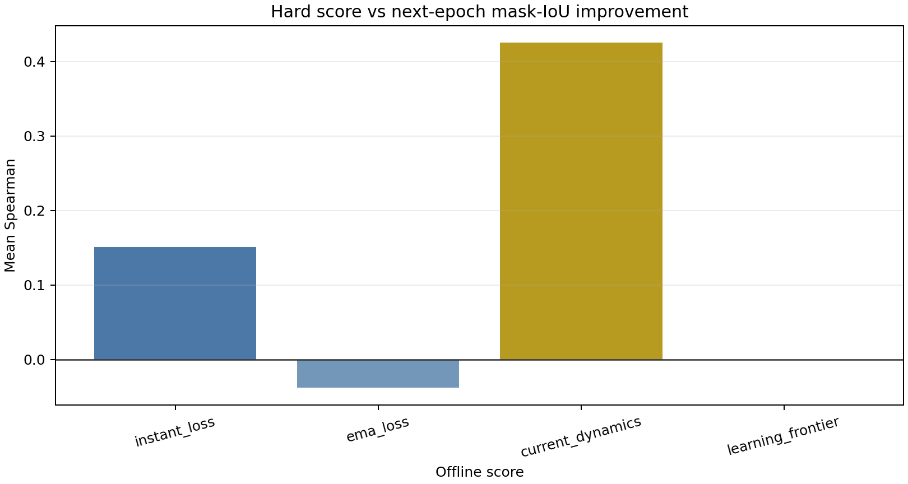

# Policy V2 Hard Definition Analysis

## Result

The V1 `HARD_LEARNABLE` rule is a high-loss rank, not a learnability test. Policy V2 freezes a Learning-Frontier prototype that requires high EMA loss, a material negative normalized slope, a real FN/mask error, an absolute loss floor, and no stalled persistent conflict/SUSPECT state.

## Learning-Frontier cohort size

| Epoch | 4 | 5 | 6 | 7 | 8 | 9 | 10 | 11 | 12 | 13 | 14 |
|---|---:|---:|---:|---:|---:|---:|---:|---:|---:|---:|---:|
| Selected | 28 | 30 | 30 | 27 | 29 | 29 | 27 | 23 | 16 | 11 | 9 |

The selected set shrinks from the high twenties to nine samples by epoch 14; it does not mechanically force 25% forever. Predictive correlations remain descriptive and are used only to preregister discovery—not to claim learnability.
