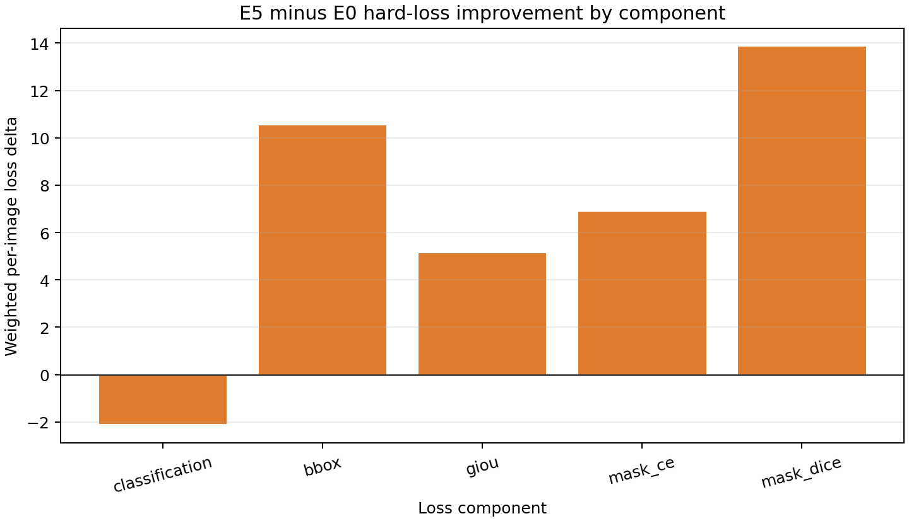

# Policy V2 Hard-Loss Component Diagnosis

## Status: `COMPLETE_SEED1_LONGITUDINAL`

This is a seed-20260810 longitudinal decomposition over the common real checkpoint window epoch 0→13 on the frozen 33-sample `REFERENCE_HARD` subset.

| Component | E0 improvement | E5 improvement | E5−E0 | Positive samples |
|---|---:|---:|---:|---:|
| classification | -40.159 | -42.244 | -2.085 | 18/33 |
| bbox | 59.890 | 70.410 | 10.520 | 18/33 |
| giou | 59.428 | 64.542 | 5.114 | 19/33 |
| mask_ce | 25.764 | 32.645 | 6.881 | 21/33 |
| mask_dice | 112.981 | 126.823 | 13.842 | 19/33 |

Only seed 20260810 has all real intermediate E0/E5 checkpoints; seed 20260811/12 component trajectories cannot be reconstructed after cleanup.
