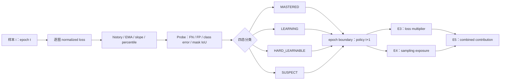
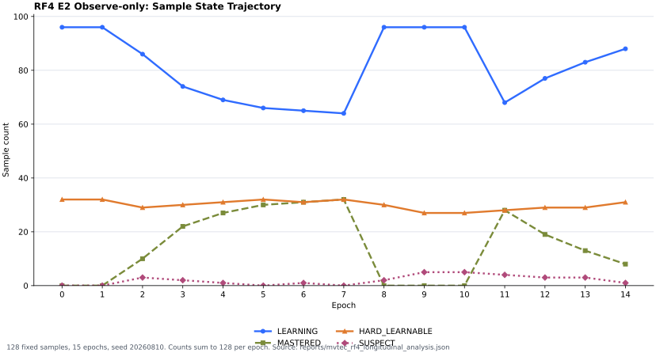

# RF-DETR Sample Dynamics 阶段性实验汇报

> 报告范围：RF-DETR Seg Small / MVTec Pilot v2 / Sample Dynamics 机制验证<br>
> 证据基线：`agent/dynamic-scheduling-rfdetr` commit `e31906a0af880bb0067d5b2a7e272a0511c39ab5`<br>
> 当前 Gate：**RF4 FAIL / BLOCKED — EMPTY_GT_PROBE_SEMANTICS**<br>
> 结论等级：**工程正确性与观察机制已有证据；算法干预收益尚未验证**

## 技术摘要

现阶段工作可以完整地整理为两条相互衔接的主线：

1. **困难样本识别**：在 loss reduction 前获得逐图 loss，按样本和 epoch 聚合历史、EMA、slope、percentile 与 Probe 指标，将样本分为 `MASTERED / LEARNING / HARD_LEARNABLE / SUSPECT`。
2. **困难样本资源调度**：在下一轮训练中，依据上一轮状态调整单次出现时的 loss multiplier，以及样本在 epoch 中的 sampling exposure；E5 Combined 同时启用两者。

这两条主线在代码上已经闭环。第一条主线已在真实 MVTec Seg Small E2 observe-only 上运行 15 epoch；第二条主线完成了单元、归一化、Sampler 和双 rank DDP Smoke 验证，但 E3/E4/E5 尚未运行真实干预实验。因此当前可以确认“能够观察和调度”，不能宣称“动态调度已经改善困难样本”。

## 两条主线构成一个跨 Epoch 控制回路



该时序保证当前 batch 的 loss 不会反过来修改同一 batch。Observation 在 epoch 末先按 `sample_id` 聚合，状态和 policy 只作用于下一 epoch；DDP 下由 rank 0 形成全局状态、policy 与采样计划后广播。

## 第一条主线：逐样本 Loss 已能形成真实纵向轨迹

### 定义和当前实现

- Loss 入口是 `weighted_per_image_normalized_loss`，不是使用 DDP 全局 `num_boxes` 重构出来的逐图近似值。
- 每个样本每个 epoch 聚合一次，避免 replay、padding 或重复出现把 patience 错当成多个 epoch。
- EMA 使用 `alpha=0.3`；slope 使用最近 `5` 个 epoch 的 loss。
- 当前 difficulty 由 loss percentile、Probe error、trend、forgetting 按 `0.50 / 0.30 / 0.15 / 0.05` 融合。
- `HARD_LEARNABLE` 的直接门槛是**当轮 per-image loss percentile ≥ 0.75**。EMA 已被记录，但当前并不是 EMA percentile 直接决定 hard。

因此，当前系统与“移动平均高 Loss 识别困难样本”的方向一致，但尚未完全等价。后续应在同一 E2 trajectory 上比较 Instant Loss、当前 Dynamics 和 EMA-Loss percentile，再冻结最终识别器。

### 15-Epoch 四类样本轨迹



图中 cohort 固定为 128 张训练图片，每个 epoch 四态数量之和均为 128。`HARD_LEARNABLE` 总体维持在 27–32 张；`MASTERED` 与 `LEARNING` 在 epoch 8 和 11 附近发生明显重排。这证明状态分类器能够连续产出结果，也表明当前 Dynamics 状态还不能被描述为稳定。

| Epoch | LEARNING | MASTERED | HARD_LEARNABLE | SUSPECT | 状态切换数 |
| ---: | ---: | ---: | ---: | ---: | ---: |
| 0 | 96 | 0 | 32 | 0 | 0 |
| 1 | 96 | 0 | 32 | 0 | 12 |
| 2 | 86 | 10 | 29 | 3 | 17 |
| 3 | 74 | 22 | 30 | 2 | 23 |
| 4 | 69 | 27 | 31 | 1 | 20 |
| 5 | 66 | 30 | 32 | 0 | 20 |
| 6 | 65 | 31 | 31 | 1 | 14 |
| 7 | 64 | 32 | 32 | 0 | 16 |
| 8 | 96 | 0 | 30 | 2 | 36 |
| 9 | 96 | 0 | 27 | 5 | 5 |
| 10 | 96 | 0 | 27 | 5 | 2 |
| 11 | 68 | 28 | 28 | 4 | 33 |
| 12 | 77 | 19 | 29 | 3 | 16 |
| 13 | 83 | 13 | 29 | 3 | 14 |
| 14 | 88 | 8 | 31 | 1 | 15 |

### Instant Loss 与 Dynamics 的稳定性

| 识别方法 | 总状态切换 | 每样本平均切换 | 中位数 | P90 | 完全不变样本比例 |
| --- | ---: | ---: | ---: | ---: | ---: |
| Instant Loss buckets | 236 | 1.8438 | 1.5 | 4.0 | 35.16% |
| Training Dynamics states | 243 | 1.8984 | 2.0 | 4.0 | 29.69% |

Instant baseline 是三桶 `EASY / MIDDLE / HARD`，Dynamics 是四态分类，所以这里只能把 churn 作为稳定性证据，不能解释为分类准确率。当前结果没有显示 Dynamics 比 Instant Loss 更稳定。

### 对未来改善的预测关系

正的 loss improvement 定义为 `loss[t] - loss[t+h]`；正的 mask-IoU improvement 定义为 `IoU[t+h] - IoU[t]`。下表为各有效 epoch window 内的样本相关性均值。

| Signal | 预测目标 | Horizon | 有效窗口 | Mean Pearson | Mean Spearman |
| --- | --- | ---: | ---: | ---: | ---: |
| Instant-Loss percentile | Loss improvement | t+1 | 14 | 0.3542 | 0.4552 |
| Instant-Loss percentile | Loss improvement | t+2 | 13 | 0.4695 | 0.5473 |
| Dynamics difficulty | Loss improvement | t+1 | 14 | 0.3293 | 0.4344 |
| Dynamics difficulty | Loss improvement | t+2 | 13 | 0.4318 | 0.5315 |
| Instant-Loss percentile | Mask-IoU improvement | t+1 | 12 | 0.0933 | 0.0813 |
| Instant-Loss percentile | Mask-IoU improvement | t+2 | 10 | 0.3392 | 0.2611 |
| Dynamics difficulty | Mask-IoU improvement | t+1 | 12 | -0.0192 | -0.0801 |
| Dynamics difficulty | Mask-IoU improvement | t+2 | 10 | 0.2337 | 0.0565 |

两种信号对未来 loss 下降都有一定正相关，但当前 Dynamics 没有超过 Instant Loss；对 mask IoU 与 FN 改善的关系更弱。这里是描述性和预测性诊断，不是干预因果证据。

### `HARD_LEARNABLE` 目前只能解释为高 Loss 候选

排除 5 个 controlled corruption 后，共记录 383 个具有后续 epoch 的自然 `HARD_LEARNABLE` 事件，覆盖 41 个样本：

- 297/383 个事件下一 epoch loss 下降；366/383 个事件在任一后续 epoch 出现 loss 下降。
- 22/383 个事件下一 epoch mask IoU 提升；32/383 个事件在任一后续 epoch 出现 mask IoU 提升。
- 第一次进入 hard 后，在 t+1/t+2/t+3 发生 loss 改善的样本分别为 36/41、37/41、38/40。
- 全体 epoch 14 有 31 个 `HARD_LEARNABLE`；排除 controlled corruption 后自然 hard 候选为 28 个。

这些数据说明高 Loss 候选常伴随后续 loss 自然下降，但 mask IoU、FN 和离开 hard 状态的改善远弱于 loss 本身。因此当前名称中的 “learnable” 尚未被干预实验验证。

## 第二条主线：Loss Weight 与 Dynamic Sampling 已完成执行器

### 状态到训练资源的默认映射

| 状态 | 当前识别语义 | Loss 基础权重 | 专属采样资源 | 调度意图 |
| --- | --- | ---: | ---: | --- |
| `MASTERED` | 至少 3 轮历史；低 loss percentile；非正 slope | 0.8 | 10% mastered replay | 降低梯度贡献，保留少量复习 |
| `LEARNING` | 不满足 mastered / hard / suspect | 1.0 | 无专属 replay | 保持标准训练资源 |
| `HARD_LEARNABLE` | 当轮高 loss percentile | 1.3 | 25% hard replay | 同时提高梯度贡献和下一轮曝光 |
| `SUSPECT` | 连续 hard、连续 Probe conflict、slope 停滞 | 0.8 | 不进入 hard replay | 避免疑似脏样本被持续放大 |

Loss 权重会在 DDP 全局做均值归一。Dynamic Sampler 采用 bucket quota，而不是每个样本独立 multinomial：

```text
60% base coverage（无放回）
25% HARD_LEARNABLE replay（有放回）
10% MASTERED replay（有放回）
 5% exploration（有放回）
```

所以用户提出的“高 Loss 样本在下一轮同时获得更高 Loss 权重和更高采样权重”，精确对应 **E5 Combined**：

```text
effective contribution
    = loss multiplier × exposure multiplier
    ≤ 2.5
```

### E0–E5 将两个干预因素隔离后再组合

| 实验 | 困难样本观察 | Loss Weight | Dynamic Sampling | 当前结果 |
| --- | --- | --- | --- | --- |
| E0 Baseline | 关闭 | 关闭 | 关闭 | 3-epoch pilot；E0-15 未跑 |
| E1 Instant Loss | 当前 loss percentile | 关闭 | 关闭 | 从 E2 离线构造 |
| E2 Observe-only | Loss + EMA + slope + Probe/state | 关闭 | 关闭 | 3 epoch 与 15 epoch 完成；RF4 blocked |
| E3 Loss Weight Only | 上一轮 state | 开启 | 关闭 | correctness pass；真实效果未跑 |
| E4 Dynamic Sampler Only | 上一轮 state | 关闭 | 开启 | DDP Smoke pass；真实效果未跑 |
| E5 Combined | 上一轮 state | 开启 | 开启 | combined path pass；真实效果未跑 |

E3 回答“单次梯度贡献提高是否有效”，E4 回答“下一轮曝光提高是否有效”，E5 回答“两者组合是否有额外收益或过度聚焦”。这种拆分保证后续收益可以归因，而不是只看 Combined 的最终指标。

## 当前阻塞项会在 Combined 中被双重放大

RF4 15-epoch E2 的 run/data integrity、hash、步数、有限值和 final-state replay 均通过，但冻结 core 将 empty-GT normal 图片的 undefined recall 记录成 `gt_recall=0`，形成 **930 个 empty-GT frozen-core conflict observation**。

分析侧已经排除 undefined recall，但 replayed state 仍遵循冻结 predicate。50 样本人工审计中有 22 张视觉正常的 `train/good` 图片因此被标记为错误语义案例。若现在启动 E5，污染状态可能同时改变 loss multiplier 和 exposure multiplier，相当于把识别错误放大两次。

因此 RF4 Gate 的正确结论是：

> **FAIL_SEMANTIC_REVIEW_REQUIRED；E3/E4/E5 继续阻塞。**

这不是动态调度方向失败，而是识别层的输入契约尚不允许安全地驱动第二条主线。

## 阶段性验收结论

| 能力 | 当前 Gate | 可以宣称 | 不可以宣称 |
| --- | --- | --- | --- |
| 逐样本 Loss 与历史轨迹 | PASS | 能在 Seg Small 真实训练中逐图观察 loss | 该 loss 已是最佳困难度定义 |
| EMA / slope / percentile | PASS WITH CAVEATS | 能形成 15 轮 longitudinal trajectory | EMA 已经优于 Instant Loss |
| 四态分类 | BLOCKED | 能持续输出四态标签 | `HARD_LEARNABLE` 已证明 learnable |
| Loss Weight | CORRECTNESS PASS | 权重路径、归一化和梯度语义可执行 | E3 已改善指标或困难样本 |
| Dynamic Sampler | DDP/SMOKE PASS | 全局 plan、rank slice 和 replay quota 可执行 | E4 已改善指标或困难样本 |
| Combined | PATH PASS | 两类资源可以组合且有 cap | E5 已获得算法收益 |

阶段性总判断：**困难样本“观察—分类—下一轮加权—下一轮重采样”的工程闭环已经搭建；第一条主线有真实纵向证据，第二条主线只有 correctness 证据。当前还没有 Sample Dynamics 算法收益结论。**

## 下一轮实验严格围绕两条主线推进

1. 只修 empty-GT Probe conflict 语义，并增加 focused tests；不为改善曲线调整其他 StatePolicy 参数。
2. 用同一 E2 trajectory 比较 Instant Loss、当前 Dynamics 和 EMA-Loss percentile，先冻结困难样本识别器。
3. 继续使用已冻结的 `REFERENCE_HARD / REFERENCE_MASTERED / CONTROLLED_CORRUPTION / CLEAN_NATURAL_HARD`，不允许各实验重新定义 hard subset。
4. 在同 checkpoint、manifest、seed、15 epochs、optimizer、batch 与 augmentation 合同下运行 E0/E3/E4/E5。
5. E3 记录实际 gradient weight；E4 记录实际 exposure；E5 记录两者乘积和 `2.5` cap 命中次数。
6. 对同一 hard subset 比较 loss、mask IoU、FN、状态恢复率和 controlled-corruption 行为；Seed 1 correctness 正常后再运行完整三 seed。

最终需要回答的问题不是“功能有没有打开”，而是：**加的资源是否投入给了正确的样本，以及这些样本是否比 E0 更快、更稳定地改善。**

## 证据索引

- 本报告紧凑分析数据：[`rf_detr_sample_dynamics_stage_report_data.json`](rf_detr_sample_dynamics_stage_report_data.json)
- 原始逐样本与逐 epoch 分析：[`mvtec_rf4_longitudinal_analysis.json`](mvtec_rf4_longitudinal_analysis.json)
- 完整 RF4 纵向报告：[`mvtec_rf4_longitudinal_validation.md`](mvtec_rf4_longitudinal_validation.md)
- RF4 run integrity：[`mvtec_rf4_run_integrity.md`](mvtec_rf4_run_integrity.md)
- Empty-GT 失败诊断：[`mvtec_rf4_failure_diagnosis.md`](mvtec_rf4_failure_diagnosis.md)
- 冻结 reference subsets：[`mvtec_reference_subsets.json`](mvtec_reference_subsets.json)
- E0–E5 实验矩阵：[`ablation_results.csv`](ablation_results.csv)
- Reference policy：[`../reference/reference_config.yaml`](../reference/reference_config.yaml)
- State policy contract：[`../reference/state_policy_spec.md`](../reference/state_policy_spec.md)
